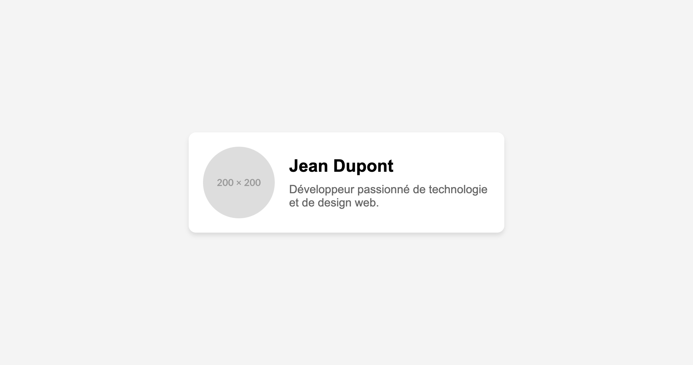

# Eval Flexbox 1

## Consignes générales

- Vous avez 1h pour réaliser cet exercice
- Vous pouvez consulter vos notes de cours, vos exercices et le contenu du cours
- Vous pouvez consulter internet
- Le travail est à réaliser individuellement
- Pas d'IA, ni de code copié-collé

## Exercice 1

**CSS UNIQUEMENT** - 10 minutes

Sur la base du code HTML (ex1.html), ajoutez les propriétés CSS manquantes (ex1.css) pour obtenir le rendu suivant :

| Critères                                                                                                    | Points |
| ----------------------------------------------------------------------------------------------------------- | ------ |
| Layout reproduit fidèlement en ajoutant les propriétés CSS cohérentes sans erreur ni propriétés superflues. | 5      |

## Exercice 2

**HTML UNIQUEMENT** - 15 minutes

Sur la base du code CSS (ex2.css), ajoutez les balises HTML (ex2.html) manquantes pour obtenir le rendu suivant :

| Critères                                                                                               | Points |
| ------------------------------------------------------------------------------------------------------ | ------ |
| Layout reproduit fidèlement en ajoutant des balises HTML cohérentes sans erreur ni balises superflues. | 5      |

## Exercice 3

**CSS UNIQUEMENT** - 15 minutes

Dans l'exercice 3, réalisez les 3 dispositions différentes en CSS, dans le fichier ex3.css.

| Critères                                                                | Points |
| ----------------------------------------------------------------------- | ------ |
| Exercices reproduits précisément, sans erreur ni propriétés superflues. | 5      |

## Exercice 4

**Figma (ou autre)** - 15 minutes

Dans l'exercice 4:

1. Ouvrez l'image dans Figma (ou Aperçu)
2. Découpez l'image en ajoutant des rectangles bien marqués pour montrer toutes les balises HTML nécessaires pour reproduire l'image en HTML/CSS
3. Exportez l'image découpée en format PNG et remplacer l'image originale par l'image découpée dans le dossier ex4

**Voici un exemple de ce qu'on attend:**

| Critères                                                                                 | Points |
| ---------------------------------------------------------------------------------------- | ------ |
| Découpe des balises complète et cohérente selon les pratiques HTML et CSS vues en classe | 5      |
